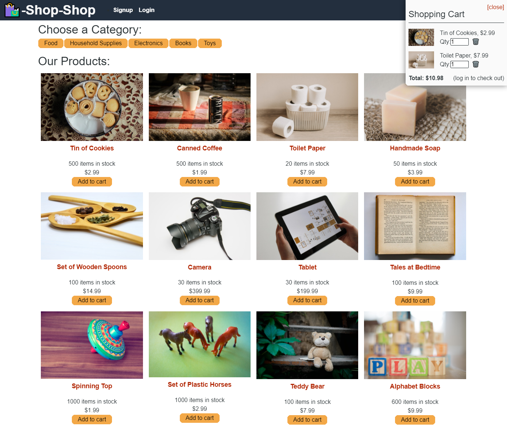

# Redux Store

## Table of Contents
* [Description](#description)
* [Built With](#built-with)
* [Installation](#installation)
* [Usage](#usage)
* [Contributing](#contributing-to-redux-store)
* [Test](#test)
* [Questions](#questions)
* [License](#license)

## Description
This project is a React.js front end with a Node.js, GraphQL, and Mongo backend that acts as an e-commerce site. Global State is handled via Redux.

See the deployed application [here]().

## Screenshot

## Built With
- Node.js
- Express.js
- Mongo.db
- Apollo Server Express
- GraphQL
- React.js
- Redux and Context API (commented out)
- Heroku

## Installation
    =============
    = Git Setup =
    =============
        $ git clone https://github.com/hsengu/redux-store
        $ cd ./redux-store
        $ npm install

## Usage
        $ npm run start:dev

## Contributing to Redux Store
Please follow contribution guidelines at the [Contributor Covenant](https://www.contributor-covenant.org/version/2/1/code_of_conduct/) to contribute to Redux Store.

## Tests
    There are no tests available for this application

## Questions
Contact me at the following:
- [hsengu's GitHub Profile](https://github.com/hsengu)
- hok.s.uy@hsengu.com

## License
This project is licensed under GNU GPL v3